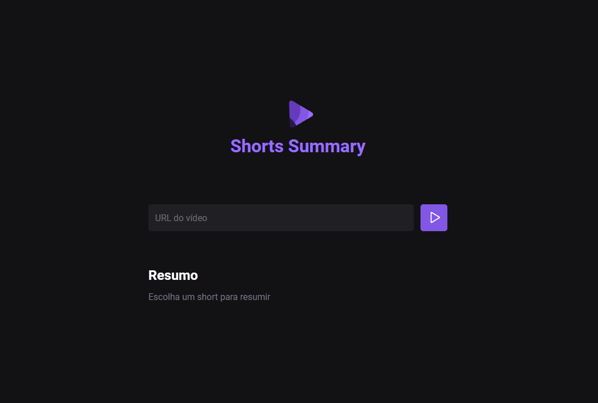

# Shorts Summary
Projeto desenvolvido para entregar ao usuário um resumo ou descrição de Shorts (vídeos curtos do YouTube). O diferencial dessa aplicação é a utilização de inteligência artificial. Esse projeto foi desenvolvido durante a Next Level Week da Rocketseat.

## :art: Figma
Acesse o layout [aqui](https://www.figma.com/file/5Ued1EQijf6JMdtKjuaPcg/Shorts-Summary?type=design&node-id=3%3A376&mode=design&t=icujTgnz8wZsjy4d-1)

## :rocket: Tecnologias
* HTML e CSS
* JavaScript
* Node.js
* Transformers.js
* Bart.AI e Whisper.AI
* Vite (Framework Vanilla)

## :computer: Como executar o projeto

1. Certifique-se de ter o Node.js instalado em sua máquina.
2. Clone este repositório para o seu computador.
3. Na pasta do projeto, abra o terminal e execute o comando `npm install` para instalar as dependências.
4. Execute o comando `npm run server` para iniciar o servidor do Back-End.
5. Em seguida, executo o comando `npm run web` em outro terminal, para iniciar a parte web da aplicação.
6. O projeto será aberto automaticamente no seu navegador padrão. Se não abrir, acesse o endereço localhost especificado no terminal.
